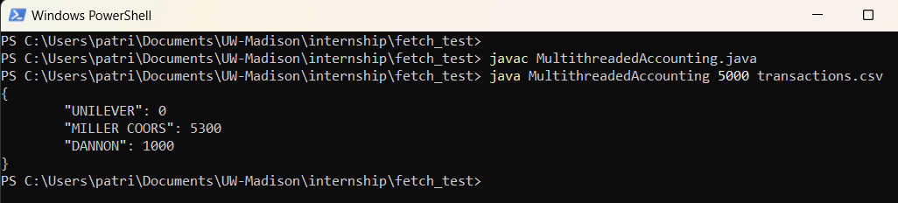

## Instructions on how to run the program.

### prerequists:
You must have some version of the JDK installed on your machine

### Instructions:
In a directory with the files MultithreadedAccounting.java and a csv file of transactions. On the command line: type the command **javac MultithreadedAccounting.java**
and press enter. Next, enter the command **java MultithreadedAccounting \<input number> \<transactions csv file>** 

### Example:

**javac MultithreadedAccounting.java**

**java MultithreadedAccounting 5000 transaction.csv**

